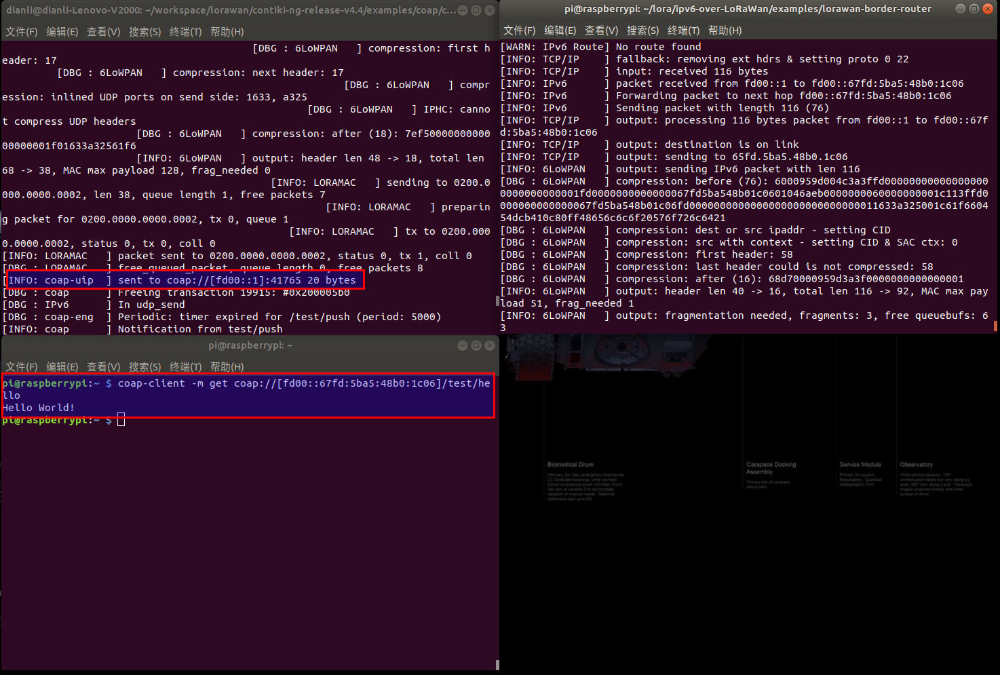

# (WIP) ipv6-over-LoRaWan
Based on Contiki-NG-4.4 and LoRaMac-node

## Introduction

Ping between device-node, border-router and host is tested. lora node CoAP server is tested. 
    Architecture:

        Dev node                                        border router                       Host
    +--------------+                                  +--------------+                   +---------+
    |App1 App2 App3|                                  |App1 App2 App3|                   | App1 ...|
    |              |                                  |              |   +-----------+   |         |
    |      UDP     |                                  |      UDP     |   |           |   |   UDP   |
    |     IPv6     |                                  |     IPv6 +---+---+ /dev/tun0 +---+  IPv6   |
    |    6LOWPAN   |                                  |    6LOWPAN   |   |           |   |         |
    |    LoRaMac   |                                  |              |   +-----------+   +---------+
    +-------+------+                                  +--------------+ 
         |                          ChirpStack               |
         |  +-------+     +-------+    +-----------+         |
         +~ |Gateway| === |Network| == |Application|..... APPserver MQTT integration ....
            +-------+     |server |    |server     |
                          +-------+    +-----------+

## howto

Hardware needed: 
1. device node: Heltec Automation's LoRa Node 151
2. border router: raspberry pi 3B, Heltec Automation's HT-M01(lora gateway)

Step:
1. Follow instructions in Raspberry PI USB mode section in
https://heltec-automation.readthedocs.io/zh_CN/latest/gateway/ht-m01/qucik_start.html#usb
to setup lora gateway.
2. Login Raspberry, and follow instructions in https://www.chirpstack.io/guides/debian-ubuntu/
to setup chirpstack loraserver.
3. Follow instructions in https://www.chirpstack.io/guides/first-gateway-device/
to setup up LoRaWAN device configuration, for now we use a classC device.
4. Loraserver should ready to communicate with lora device node now

             git clone https://github.com/aenrbes/ipv6-over-LoRaWan.git
             cd examples/lorawan-border-router
             make
             sudo ./border-router -a 1 fd00::1/64
             (the "-a" option correspond the appID in chirpstack)

5. On your development computer

             git clone https://github.com/aenrbes/ipv6-over-LoRaWan.git
             (you need change Commissioning.h in arch/cpu/loramac/mac/Inc according to loraserver configuration)
             cd examples/hello-world
             make TARGET=loramac

6. Flash hello-world.hex into lora node 151.
7. You can use ping command to ping each other. Have fun!

## test picture
1. CoAP test, lora node work as CoAP server, use CoAP client from host.

2. Ping test, host ping lora node.

3. other test picture is under test-picture/

Find out more:

* Contiki-NG: https://github.com/contiki-ng/contiki-ng
* LoRaMac-node: https://github.com/Lora-net/LoRaMac-node

