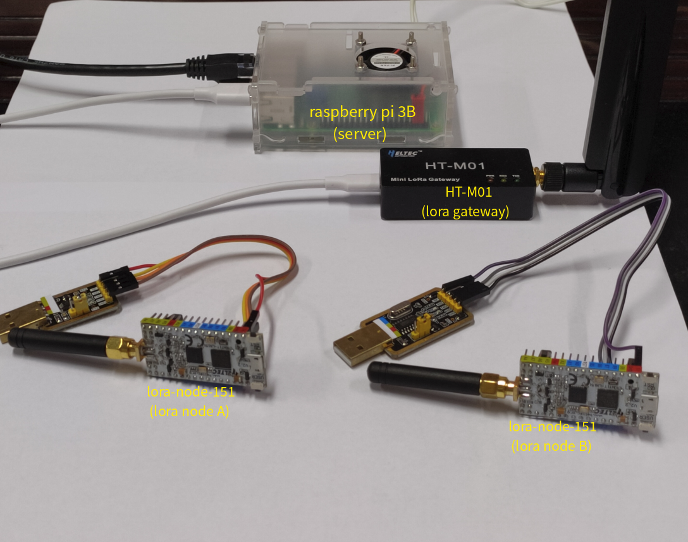

# (WIP) IPv6-over-LoRaWAN
* Based on Contiki-NG-4.4, LoRaMac-node, libschc, ChirpStack

## Introduction
Ping between device-nodes, border-router and host is tested. lora node CoAP server is tested.(in
 6lowpan mode, schc NO_ACK and ACK_ALWAYS mode)

* Contiki-NG : works as layer 3 and above of IPv6 protocol stack for both node and server side,
and can build applications easily on top of the stack.
* libschc : libschc is a C implementation of the Static Context Header Compression(see RFC8724), it is a header
compression technique used in LPWAN. It works as the adaptation layer between IP and MAC layer,
provide both the compression and the fragmentation mechanism. In the following tests, it is assumed that the
MAC layer MTU is 51 byte.
* libschc NOTE: libschc is work in progress, it's internal state machine still has
some bugs, for now only NO_ACK and ACK_ALWAYS fragmentation mode works and is tested. As an alternative,
6LoWPAN provided by contiki-ng can be used instead of libschc.
* LoRaMac-node : provide LoRaWAN node side MAC layer and the bottom layer driver used by contiki-ng such
as RTC, UART...
* ChirpStack : works as LoRaWAN server on the host. ChirpStack provide MQTT integration whick can
be used to send and receive device data.

* Architecture:

        node(contiki-ng)                              border router(contiki-ng)           Host(raspbian/ubuntu)
        +--------------+                                  +--------------+                   +---------+
        |App1 App2 App3|                                  |App1 App2 App3|                   | App1 ...|
        |              |                                  |              |   +-----------+   |         |
        |      UDP     |                                  |      UDP     |   |           |   |   UDP   |
        |     IPv6     |                                  |     IPv6     +---+ /dev/tun0 +---+  IPv6   |
        | 6LOWPAN/SCHC |                                  | 6LOWPAN/SCHC |   |           |   |         |
        |    LoRaMac   |                                  | libmosquitto |   +-----------+   +---------+
        +-------+------+                                  +---------+----+ 
                |                          ChirpStack               |
                |  +-------+     +-------+    +-----------+         |
                +~ |Gateway| === |Network| == |Application|..... APPserver MQTT integration ....
                   +-------+     |server |    |server     |
                                 +-------+    +-----------+

## howto

Hardware needed: 
1. device node: Heltec Automation's LoRa Node 151
2. border router: raspberry pi 3B, Heltec Automation's HT-M01(lora gateway)

Step:
1. Follow instructions in Raspberry PI USB mode section in
https://heltec-automation.readthedocs.io/zh_CN/latest/gateway/ht-m01/qucik_start.html#usb
to setup lora gateway.
2. Login Raspberry, and follow instructions in https://www.chirpstack.io/guides/debian-ubuntu/
to setup chirpstack loraserver.
3. Follow instructions in https://www.chirpstack.io/guides/first-gateway-device/
to setup up LoRaWAN device configuration, for now we use a classC device.
4. Loraserver should ready to communicate with lora device node now

             git clone https://github.com/aenrbes/ipv6-over-LoRaWan.git
             cd examples/lorawan-border-router
             make
             sudo ./border-router -a 1 fd00::1/64
             (the "-a" option correspond the appID in chirpstack)

5. On your development computer

             git clone https://github.com/aenrbes/ipv6-over-LoRaWan.git
             (you need change Commissioning.h in arch/cpu/loramac/mac/Inc according to loraserver configuration)
             cd examples/hello-world
             make TARGET=loramac

6. Flash hello-world.hex into lora node 151.
7. You can use ping command to ping each other now. Have fun!

## test picture
1. CoAP test, lora node work as CoAP server, use CoAP client in host (6lowpan).

.png "coap hello world")

2. Ping test, lora node B ping lora node A (schc).

.png "node ping node")

3. Hardware platform.

4. other test picture is under test-picture/(include node ping host...)

## note
If you want to use 6LoWPAN, you need to checkout to commit named "add downlink retry",
the downlink retry does not work perfectly, it often miss ack from device node.

## todo
Fix libschc further to support ACK_ON_ERROR fragmentation mode.

## find out more:

* Contiki-NG: https://github.com/contiki-ng/contiki-ng
* LoRaMac-node: https://github.com/Lora-net/LoRaMac-node
* libschc: https://github.com/imec-idlab/libschc
* ChirpStack: https://www.chirpstack.io/

## author's email 
* 1340247461@qq.com, hctang
